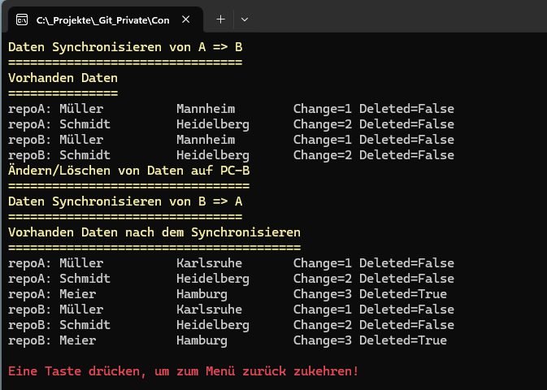

# Console DataSync


# Projekt 
in dem Demo geht es um das kniffliche Problem, des inhaltlichem Datenabgleich zweier Dateien

## Hinweis
Der Source ist soll auch einfache Art und Weise die Funktionen eines Features zeigen. Der Source ist so geschrieben, das so wenig wie möglich zusätzliche NuGet-Pakete benötigt werden.

# Referenzimplementierung einer bidirektionalen JSON-Synchronisation
Die vorgestellte Lösung demonstriert die grundlegenden Konzepte einer bidirektionalen Synchronisation zwischen zwei unabhängigen Anwendungen. Als Transportmedium wird eine JSON-Datei verwendet. Die Lösung ist bewusst einfach gehalten und dient als Referenzprojekt zum Verständnis der Synchronisationslogik sowie als Grundlage für eigene Erweiterungen.

## Architektur

Die Lösung besteht aus mehreren klar getrennten Komponenten:
- Repository verwaltet den lokalen Datenbestand.
- ChangeTracker übernimmt sämtliche lokalen Änderungen und aktualisiert automatisch die Synchronisationsinformationen.
- JsonExporter exportiert geänderte Datensätze in eine JSON-Datei.
- JsonImporter liest eine JSON-Datei wieder ein.
- SyncEngine übernimmt den eigentlichen Datenabgleich.
- SyncManager koordiniert Export, Import und Synchronisation.
- SyncMetadata speichert die Synchronisationsinformationen jedes Datensatzes.
Jede Klasse besitzt dabei genau eine klar definierte Aufgabe. Dadurch bleibt die Lösung übersichtlich und leicht erweiterbar.

## Eigenschaften der Lösung
Die Synchronisation unterstützt folgende Funktionen:
- bidirektionale Synchronisation zwischen zwei Programmen
- inkrementeller Datenaustausch
- JSON als reines Transportformat
- generischer Aufbau für beliebige Entitätstypen
- SoftDelete anstelle eines sofortigen Löschens
- automatische Vergabe von Änderungsinformationen
- Trennung zwischen Fachlogik und Synchronisationslogik
- objektorientierter Aufbau mit klaren Verantwortlichkeiten

Da die Synchronisation generisch aufgebaut ist, können neben Kunden später auch andere Entitäten wie Artikel, Aufträge oder Kontakte synchronisiert werden, sofern diese das Interface ISyncEntity implementieren.

## Grenzen der Lösung
Die Referenzimplementierung wurde bewusst einfach gehalten und besitzt daher einige Einschränkungen.
- Keine Konfliktbehandlung\
  Es wird vorausgesetzt, dass niemals zwei Benutzer gleichzeitig denselben Datensatz bearbeiten.
- Keine Mehrbenutzerreplikation\
  Die Lösung ist auf zwei Synchronisationspartner ausgelegt.
- Kein Änderungsjournal\
  Die Synchronisation arbeitet direkt auf den Datensätzen.
- SoftDelete\
  Gelöschte Datensätze bleiben zunächst im Datenbestand erhalten und werden lediglich als gelöscht markiert. Ein endgültiges physisches Entfernen der Datensätze ist in der Referenzimplementierung nicht vorgesehen und müsste durch einen späteren Bereinigungsschritt erfolgen.
- Keine Netzwerkkommunikation\
  Die Synchronisation erfolgt ausschließlich über JSON-Dateien. Der Transport selbst ist nicht Bestandteil der Lösung.
- Keine Sicherheitsmechanismen\
  Die JSON-Dateien werden weder verschlüsselt noch signiert. Ebenso erfolgt keine Benutzer- oder Rechteprüfung.

## Beispielsource

Der Beispielsource ist in meherern Schritten aufgeteilt. Hier wird nur der letzte vollständige Schritt gezeigt.



```csharp
var repoA = RepositoryFactory.Create<Kunde>("PC A");
var repoB = RepositoryFactory.Create<Kunde>("PC B");

var trackerA = new ChangeTracker<Kunde>(repoA);
var trackerB = new ChangeTracker<Kunde>(repoB);

var syncA = new SyncManager<Kunde>(repoA);
var syncB = new SyncManager<Kunde>(repoB);

var kunde = trackerA.Insert(new Kunde()
{
    Name = "Müller",
    Ort = "Mannheim"
});

trackerA.Insert(new Kunde()
{
    Name = "Schmidt",
    Ort = "Heidelberg"
});

Console.Title("Daten Synchronisieren von A => B");
syncA.Export("AtoB.json", repoB.Device.DeviceId);
syncB.Import("AtoB.json");

Console.Title("Vorhanden Daten");
foreach (var item in repoA.Items)
{
    Console.WriteLine($"repoA: {item.ToString()}");
}

foreach (var item in repoB.Items)
{
    Console.WriteLine($"repoB: {item.ToString()}");
}

Console.Title("Ändern/Löschen von Daten auf PC-B");
trackerB.Update(kunde.Id,
    x => { x.Ort = "Karlsruhe"; });

trackerB.Insert(new Kunde()
{
    Name = "Meier",
    Ort = "Hamburg"
});

trackerB.Delete(repoB.Items.Last().Id);

Console.Title("Daten Synchronisieren von B => A");
syncB.Export("BtoA.json", repoA.Device.DeviceId);
syncA.Import("BtoA.json");

Console.Title("Vorhanden Daten nach dem Synchronisieren");
foreach (var item in repoA.Items)
{
    Console.WriteLine($"repoA: {item.ToString()}");
}

foreach (var item in repoB.Items)
{
    Console.WriteLine($"repoB: {item.ToString()}");
}

```

# Versionshistorie

- Migration auf NET 10
